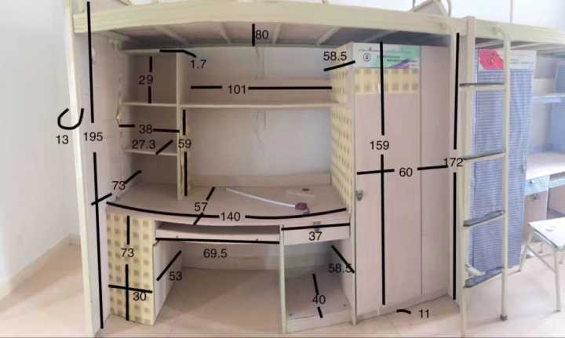

# 问答

一些关于学校，学院以及跨专选择之类可公开或常见问题的仓库

主要内容
- [关于学校的一些问题](school.md)
  - 江安寝室怎么样
  - 江安床多大
  - 开学之前的准备什么的 点击[这里](#开学准备)
  - ...
- [关于学院的一些问题](college.md)
  - 毕业多少学分
  - (我感觉说一下去哪儿看就好了?)
- 关于选课的一些问题
  - 专选
    - 推荐与选择时间等
  - 跨专(算是整理一下吧)
- [来一点高三暑假才会有的问题？](ThisBoringSummer.md)
- [需要一点社团/组织介绍？](association.md)
  - 是什么
  - 干什么
  - 活跃度
  - 主要活动

## 课程指南
 
在course文件夹中

## 开学准备

如果对于专业，现在有一点兴趣想去了解的话；亦或是暑假闲不下来，想学习一点什么东西的话，可以点击[这里](ThisBoringSummer.md)

如果是想了解一点基础信息的话，就接着看。

某些新生群里广告或许有一点信息价值，但是太多了。

### 寝室
寝室的床大概是 **1.9\*0.85**

开学的时候，可以在床上买床上用品（质量一般，没有特殊需求的话，够用了），如果没记错或者没变动的话，有
- (枕头+枕套)x2
- (被子+被套)x2
- 床单(记不清楚了)
- 床垫
- 蚊帐
- 热水瓶
### 电话卡

> 电话卡建议办，但不一定需要暑假办，开学在学校线下办就好了~~毕竟暑假办的，线下也要去一趟~~

> 为什么那么多广告想你办卡？~~因为一张卡能赚50￥（2021年数据）~~

校园电话卡是运营商专门为新生推出的低资费高流量+校园服务的成都电话卡。今年（2021）资费在28元左右每月，几百g流量。个人来说，对于大学生是很有优惠的。新生可按需进行办理，提高防骗意识就可以了，可以没事去咨询办理业务的学长学姐~~，然后可以不办~~。

### 棉被

开学时学校里面会有统一进行购买的地方，但是学校棉被质量一般，所以出现了很多卖被子的学长学姐。
大家可以选择开学后在学校购买（到时候买了是一套，不是棉被，还是保温瓶，枕套，蚊帐等）也可以选择自行网上购买。

### 学车
可以考虑在学校学车，价格看上去很优惠，但不知道有没有暗坑，建议考查和咨询后再说，看个人需求。

### 买电脑
如果没有特别定制化的需求或者之类的，建议直接微信搜 **笔吧评测室** 去看看测评这些

或者下方选购指南自己看看<https://mp.weixin.qq.com/s/gj_wXn6lZPZO1eGN2jKv8g>